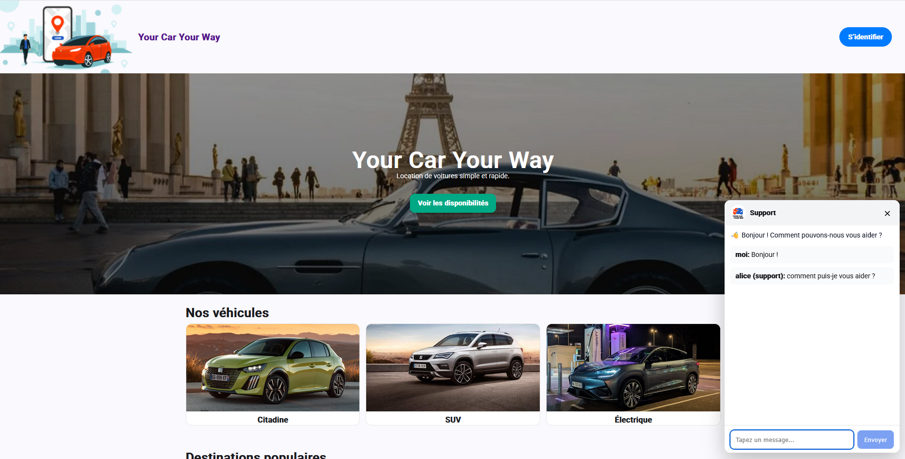
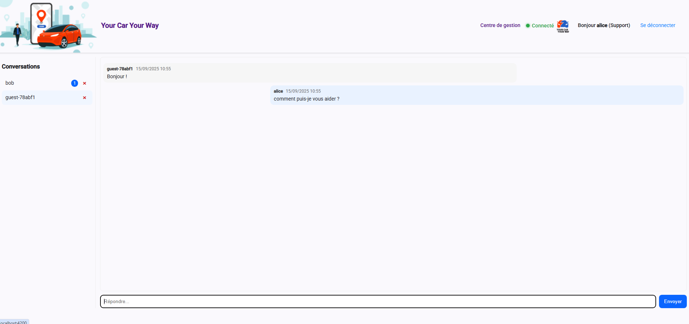
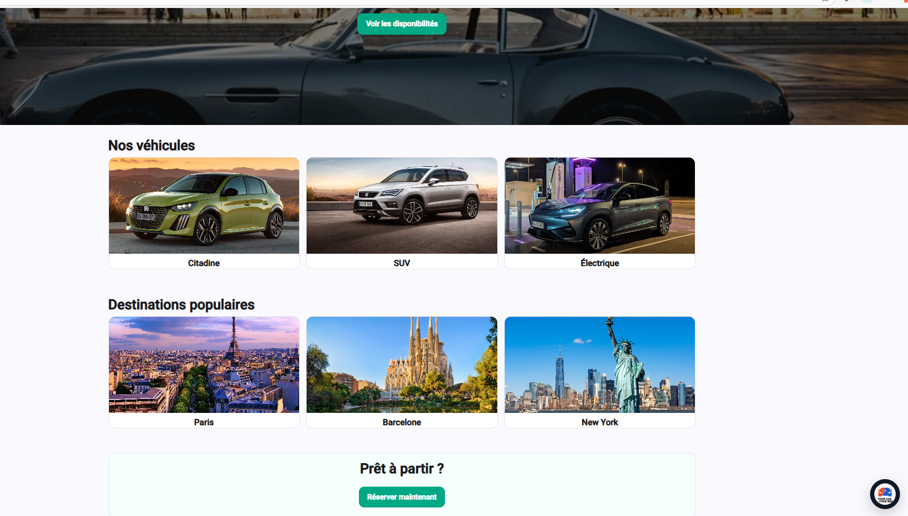

# Your Car Your Way 🚗💬

Bienvenue / Welcome! 👋

Veuillez choisir votre langue / Please choose your language:

- 🇫🇷 [Lire en français](#-français)
- 🇬🇧 [Read in English](#-english)

---

### 📸 Screenshots

<div style="text-align: center;">

  
<p>💬 Chat home page / Page principale du chat</p>
  
 <p>📞 Chat support page / Chat depuis la page de support</p>
  
<p>⭕ Bubble chat (bottom-right) / Bulle du chat en bas à droite</p>
</div>

---

## 🇫🇷 Français

### 📖 Présentation
**Your Car Your Way** est une application de location de voitures internationale.  
Ce projet correspond à un **Proof of Concept (PoC)** mettant en avant la fonctionnalité de **chat en ligne** entre clients et support.

---

### 🛠️ Technologies utilisées
- **Backend** : Spring Boot 3 (Java 24), JWT, WebSocket, Spring Security
- **Frontend** : Angular 20, TypeScript, RxJS
- **Build tools** : Gradle (backend), Angular CLI (frontend)
- **Database** : [schema_bdd.sql](back/docs/schema_bdd.sql)

---

### 📦 Récupérer le projet
Cloner le dépôt
```
git clone https://github.com/MatthieuSKRZYPCZAK/P13_YourCarYourWay.git
cd P13_YourCarYourWay
```

---

### 🚀 Lancer le backend
Prérequis : **Java 24**
```
# depuis le dossier racine
 cd back
 ./gradlew clean build
 ./gradlew bootRun
```

👉 L’API sera disponible sur : http://localhost:8080

---

### 🌐 Lancer le frontend
```
# depuis le dossier racine
 cd front
 npm install
 ng serve -o
```

👉 L’application sera disponible sur : http://localhost:4200


---

## 🇬🇧 English
### 📖 Overview

**Your Car Your Way** is an international car rental application.
This project is a **Proof of Concept (PoC)** showcasing the **live chat** functionality between customers and support.


### 🛠️ Technologies used

- **Backend**: Spring Boot 3 (Java 24), JWT, WebSocket, Spring Security
- **Frontend**: Angular 20, TypeScript, RxJS
- **Build tools**: Gradle (backend), Angular CLI (frontend)
- **Database** : [schema_bdd.sql](back/docs/schema_bdd.sql)

---

### 📦 Clone the project
Clone the repository
```
git clone https://github.com/MatthieuSKRZYPCZAK/P13_YourCarYourWay.git
cd P13_YourCarYourWay
```

---

### 🚀 Run the backend
Requirements : **Java 24**
```
# from the project root
 cd back
 ./gradlew clean build
 ./gradlew bootRun
```

👉 API available at : http://localhost:8080

---

### 🌐 Run the frontend
```
# from the project root
 cd front
 npm install
 ng serve -o
```

👉 Application available at : http://localhost:4200


